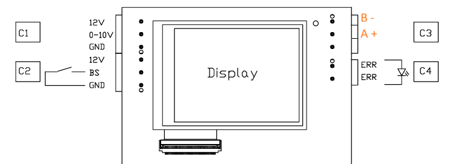
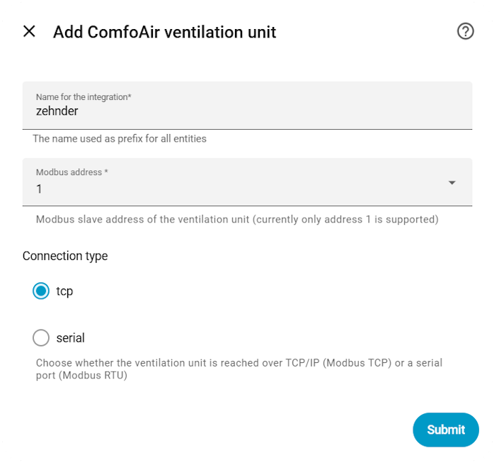
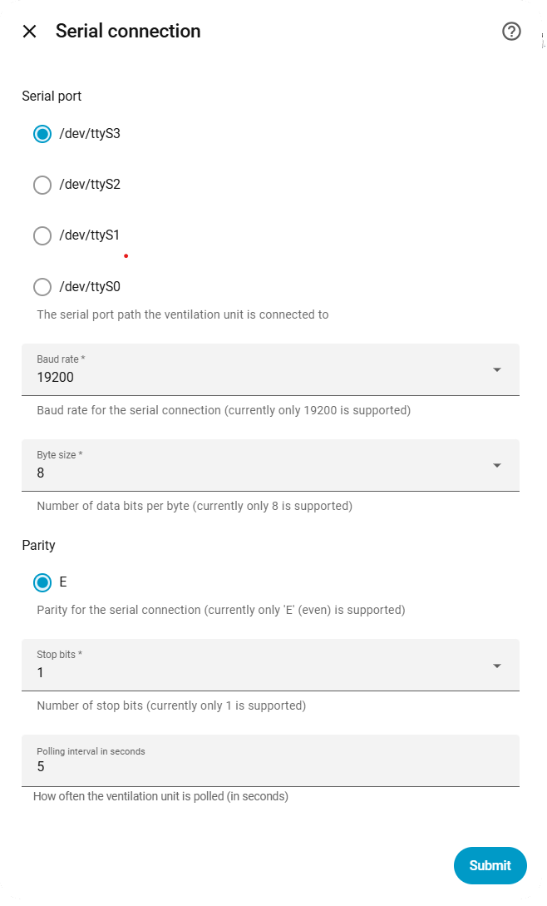
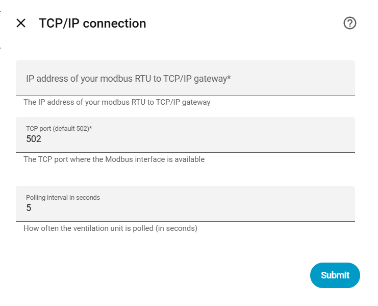
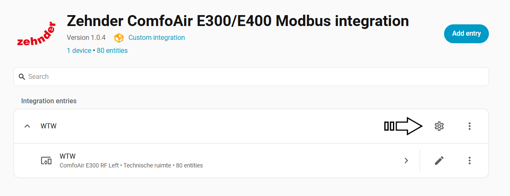
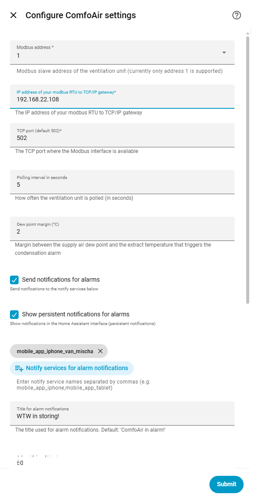
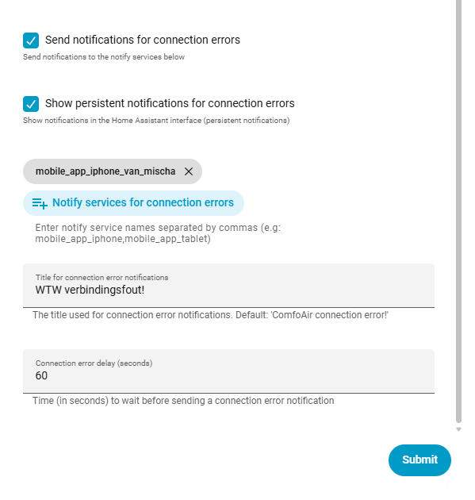
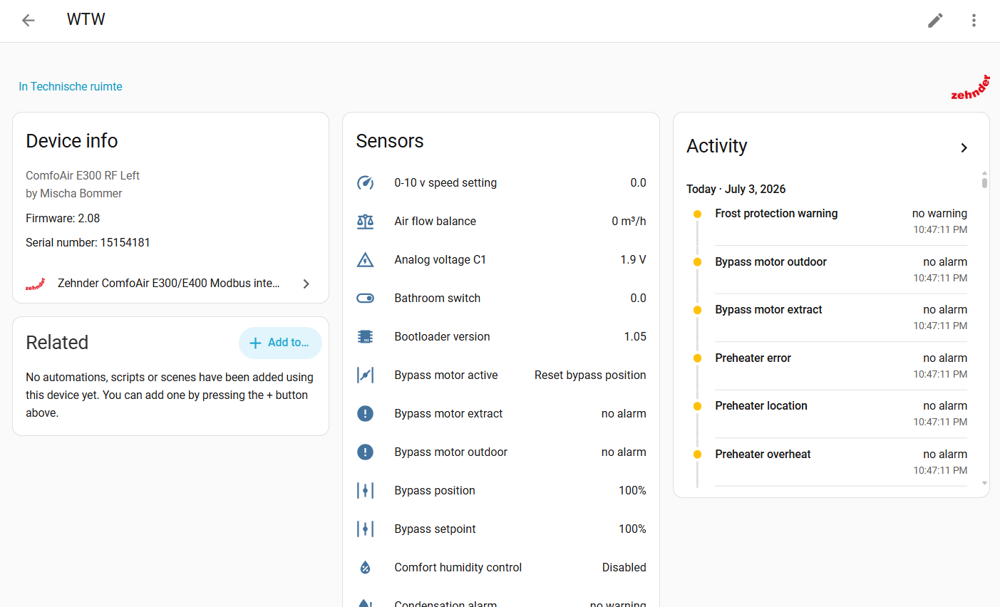

# Zehnder ComfoAir E300/E400 Home Assistant Integration

A Home Assistant custom integration for the Zehnder ComfoAir E300/E400 ventilation unit over Modbus (RTU or TCP), with a full sensor set, alarm monitoring, and configurable notifications.

> **Disclaimer**: This is an independent, community-built integration. It is not affiliated with, endorsed by, or supported by Zehnder. "Zehnder" and the Zehnder logo are trademarks of their respective owner, used here only to identify compatible hardware. The software is provided as-is (see [LICENSE](LICENSE)); wiring your unit and connecting a gateway is done at your own risk.

## Features

- Modbus RTU (serial) and Modbus TCP support, fully configurable through the Home Assistant UI (no YAML).
- 40+ sensors: temperatures, humidities, fan speeds, air flows, bypass position, speed setpoints, runtime counters and more.
- Calculated comfort sensors: absolute humidity, enthalpy, dew point (per air stream) and heat recovery efficiency.
- Binary sensors for every alarm/warning bit reported by the unit (sensor failures, filter warning/error, pre-heater faults, bypass motor faults, frost protection) plus a supply-air condensation alarm derived from the dew point.
- Optional push and/or persistent notifications for alarms and for connection errors, with a configurable delay and quiet hours (07:00-23:00) for non-urgent warnings.
- Fully reconfigurable afterwards via the integration's options screen - no need to remove and re-add the integration to change settings.

## Installation

### HACS Custom Repository

1. Open HACS in Home Assistant.
2. Click the three dots menu (⋮) in the top right corner.
3. Select 'Custom repositories'.
4. Add this repository URL: `https://github.com/remmob/comfoair`.
5. Set the category to **Integration**.
6. Click 'Add' to save.

See the [official HACS documentation](https://hacs.xyz/docs/faq/custom_repositories/) for more details.

### Manual

1. Download or copy the `comfoair` folder from this repository:
	[`custom_components/comfoair`](../comfoair)
2. Place this folder in your Home Assistant installation under:
	`config/custom_components/comfoair`
3. Restart Home Assistant.
4. Add the integration via the Integrations screen in the Home Assistant UI.

More info and updates:
- [GitHub: remmob/comfoair](https://github.com/remmob/comfoair)

## Hardware Requirements
This integration uses Modbus to connect to the Zehnder E300/E400 unit.

You can use a USB to RS485 adapter to connect to the unit. The adapter should be connected to the Modbus port on the unit. 
A+ to A and B- to B, if you receive no data, try to swap the A and B wires.
 Or alternatively, you can use a WiFi/Ethernet to RS485 gateway, which allows you to connect to the unit wirelessly or over ethernet.
Like an Elfin EW-11.

> ## Important! 
>Do not use the 12V of the Zehnder unit to power your gateway or WiFi device. It can not provide enough power and can damage your device. Use a separate power supply for your gateway or WiFi device.  

The integration supports both Modbus RTU (via USB) and Modbus TCP (via WiFi/Ethernet).

## Adding the Integration

Go to the Integrations page in Home Assistant and click on "Add Integration". Search for "Zehnder ComfoAir" and select it.

Give the unit a name (default: "zehnder"), used as a prefix for all its entities. The device ID cannot be changed and should be set to 1. Then choose the connection type (TCP or serial).

For a **serial (Modbus RTU)** connection, pick one of the available serial ports on your system. The connection settings are fixed and cannot be changed:
- Baudrate: 19200
- Parity: Even
- Stopbits: 1
- Bytesize: 8

For a **TCP** connection, provide the IP address and port of your Modbus TCP gateway. The default port is 502. Configure your Modbus RTU-to-TCP gateway with the same fixed serial settings as above.

The last step is to select how the bypass/pre-heater is controlled: analog (0-10V), RF, or 3-way switch. This determines which registers are active; registers for the other control types stay available but inactive. You can change this later from the integration's settings.

## Configuring the Integration

All settings can be changed after setup, without removing the integration. Open the integration's entry and click the gear icon.

This opens the settings screen, where you can change the connection details, the polling interval, the dew point margin used for the condensation alarm, and the notification behavior for alarms and connection errors.

- **Dew point margin**: how close the supply air dew point may get to the extract air temperature before the condensation alarm triggers.
- **Alarm notifications**: optionally send a mobile push notification and/or a persistent notification when any alarm/warning bit becomes active, after a configurable delay. Filter warning and frost protection warning (non-urgent) are only pushed between 07:00-23:00; outside that window they are held and sent at 07:00.
- **Connection error notifications**: same mechanism, triggered when the unit becomes unreachable over Modbus.
- Notify services can be picked from your configured `notify.mobile_app_*` services, or entered manually as a comma-separated list.

The device page shows the device info, all sensors and the recent alarm/warning activity:

## Register Table

| Register | Name                                          | Datatype | Unit   | Scale | Note                                                       |
|----------|------------------------------------------------|----------|--------|-------|-------------------------------------------------------------|
| 101      | Device status                                  | uint16   | -      | 1     | 0:Error;1:Initializing;2:Self Test;3:Waiting;10:Normal;20:Standby;42:Maintenance |
| 105      | Language                                       | uint16   | -      | 1     | 0:NL;1:DE;2:FR;3:EN                                          |
| 110      | Firmware version                               | uint16   | -      | 1     | 20800 = 2.8.0                                                |
| 111      | Orientation                                    | uint16   | -      | 1     | 0:Right;1:Left                                               |
| 112      | Model                                          | uint16   | -      | 1     | 0:E300 P;2:E300 RF;3:E400 RF                                 |
| 113      | Bootloader / hardware version                  | uint16   | -      | 1     | Packed as bootloader.hardware, e.g. 3.05                     |
| 115-130  | Serial number                                  | uint16   | -      | -     | One ASCII character per register                             |
| 300      | Intake air temperature                         | int16    | °C     | 0.1   |                                                               |
| 301      | Pre-heater temperature                         | int16    | °C     | 0.1   |                                                               |
| 303      | Supply air temperature                         | int16    | °C     | 0.1   |                                                               |
| 304      | Extract air temperature                        | int16    | °C     | 0.1   |                                                               |
| 305      | Exhaust air temperature                        | int16    | °C     | 0.1   |                                                               |
| 306      | Intake air humidity                            | uint16   | %      | 0.1   |                                                               |
| 307      | Supply air humidity                            | uint16   | %      | 0.1   |                                                               |
| 308      | Extract air humidity                           | uint16   | %      | 0.1   |                                                               |
| 309      | Exhaust air humidity                           | uint16   | %      | 0.1   |                                                               |
| 310      | Extract air fan                                | uint16   | %      | 0.1   |                                                               |
| 311      | Supply air fan                                 | uint16   | %      | 0.1   |                                                               |
| 312      | Extract air flow                                | uint16   | m³/h   | 1     |                                                               |
| 313      | Supply air flow                                 | uint16   | m³/h   | 1     |                                                               |
| 314      | Extract air fan speed                          | uint16   | rpm    | 1     |                                                               |
| 315      | Supply air fan speed                           | uint16   | rpm    | 1     |                                                               |
| 316      | Analog voltage C1                              | uint16   | V      | 0.01  |                                                               |
| 317      | RF voltage                                     | uint16   | V      | 0.01  |                                                               |
| 318      | RF enabled                                     | uint16   | -      | 1     | 0:OFF;1:ON                                                    |
| 319      | Pre-heater state                               | uint16   | -      | 1     | 0:OFF;1:ON                                                    |
| 320      | Extract air flow setpoint +- balance offset    | uint16   | m³/h   | 1     |                                                               |
| 321      | Supply air flow setpoint                       | uint16   | m³/h   | 1     |                                                               |
| 322      | Running mean outdoor temperature               | int16    | °C     | 0.1   |                                                               |
| 325      | Bypass motor active                            | uint16   | -      | 1     | 0:Reset bypass position;1:End position reached;2:Active      |
| 326      | Bypass setpoint                                | uint16   | %      | 1     |                                                               |
| 327      | Bypass position                                | uint16   | %      | 1     |                                                               |
| 328      | 0-10 V speed setting                           | uint16   | %      | 1     | 0:low;50:medium;100:high                                     |
| 329      | RF speed setting                               | uint16   | %      | 1     | 0:low;50:medium;100:high                                     |
| 330      | 3-way switch                                   | uint16   | %      | 1     | 0:low;50:medium;100:high                                     |
| 331      | Bathroom switch                                | uint16   | -      | 1     | 0:off;100:on                                                 |
| 334      | Defrost cycles last 24h                        | uint16   | -      | 1     |                                                               |
| 336      | Runtime in days                                | uint16   | days   | 1     |                                                               |
| 337      | Fireplace present                              | uint16   | -      | 1     | 0:OFF;1:ON                                                    |
| 338      | Pre-heater present                              | uint16   | -      | 1     | 0:OFF;1:ON                                                    |
| 344      | Heat exchanger type                            | uint16   | -      | 1     | 0:HRV;1:ERV                                                  |
| 345      | Comfort humidity control                       | uint16   | -      | 1     | 0:Disabled;1:Enabled                                         |
| 400      | Alarm bits, bank 1                              | uint16   | -      | -     | Bitmask, see [Alarm bits](#alarm-bits)                       |
| 402      | Alarm bits, bank 2                              | uint16   | -      | -     | Bitmask, see [Alarm bits](#alarm-bits)                       |

**Datatype**: uint16 = unsigned 16-bit, int16 = signed 16-bit.

**Scale**: Value must be multiplied by this factor for real-world value.

### Alarm bits

| Register | Bit | Description                    |
|----------|-----|----------------------------------|
| 400      | 0   | T20 temperature sensor          |
| 400      | 1   | T21 temperature sensor          |
| 400      | 2   | T22 temperature sensor          |
| 400      | 3   | T11 temperature sensor          |
| 400      | 4   | T12 temperature sensor          |
| 400      | 5   | RH20 humidity sensor            |
| 400      | 6   | RH22 humidity sensor            |
| 400      | 7   | RH11 humidity sensor            |
| 400      | 8   | RH12 humidity sensor            |
| 400      | 9   | dp12 pressure sensor            |
| 400      | 10  | dp22 pressure sensor            |
| 400      | 11  | Exhaust fan speed sensor        |
| 400      | 12  | Supply fan speed sensor         |
| 400      | 13  | Filter warning                  |
| 400      | 14  | Filter error                    |
| 402      | 0   | Pre-heater overheat             |
| 402      | 1   | Pre-heater location             |
| 402      | 2   | Pre-heater error                |
| 402      | 3   | Bypass motor extract            |
| 402      | 4   | Bypass motor outdoor            |
| 402      | 5   | Frost protection warning        |

Each bit is exposed as its own binary sensor. "Filter warning" and "Frost protection warning" are treated as non-urgent warnings and are subject to the 07:00-23:00 mobile notification window described above; all other bits are treated as alarms.

### Calculated sensors

These are not raw Modbus registers, but derived from the temperature/humidity registers above:

- **Absolute humidity** (kg/kg) and **enthalpy** (kJ/kg) for the intake, supply, extract and exhaust air streams.
- **Dew point** (°C) for the intake, supply, extract and exhaust air streams, used among other things to drive the supply-air condensation alarm.
- **Heat recovery efficiency** (%), based on supply and extract air temperatures.
- **Air flow balance** (m³/h), the difference between supply and extract air flow.

---
©2026 Bommer Software | Author: Mischa Bommer
