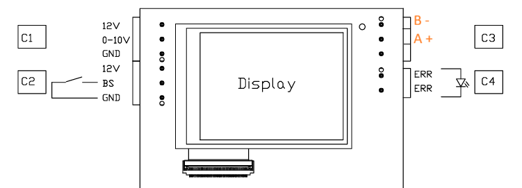
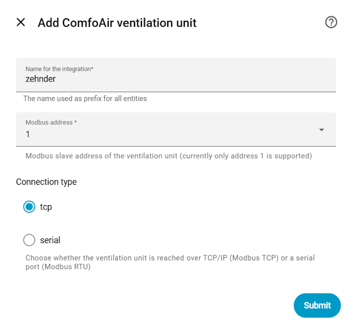
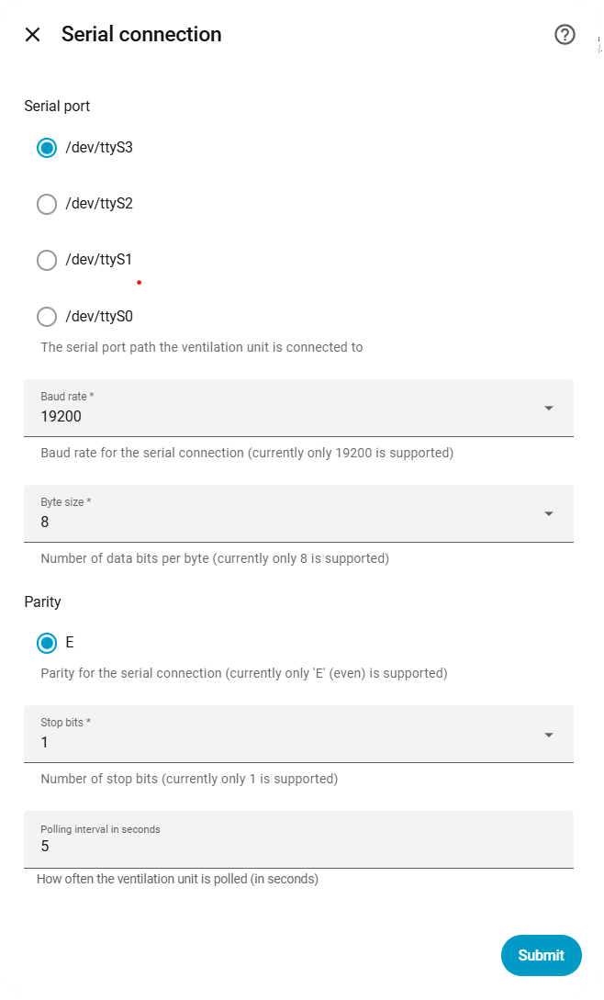
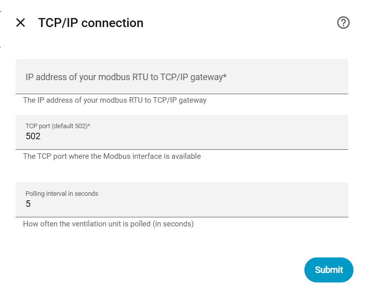
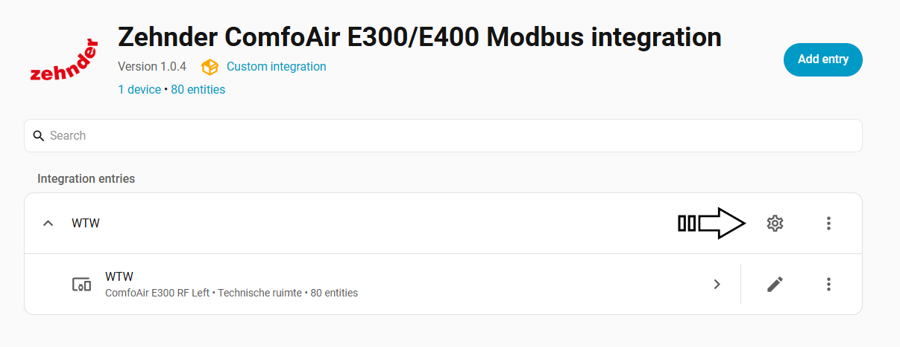
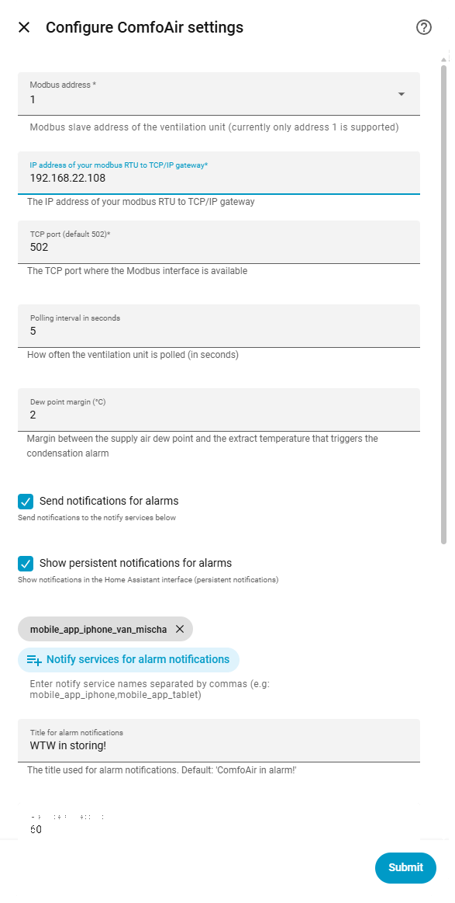
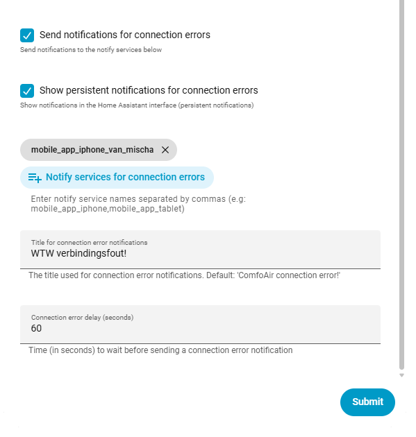
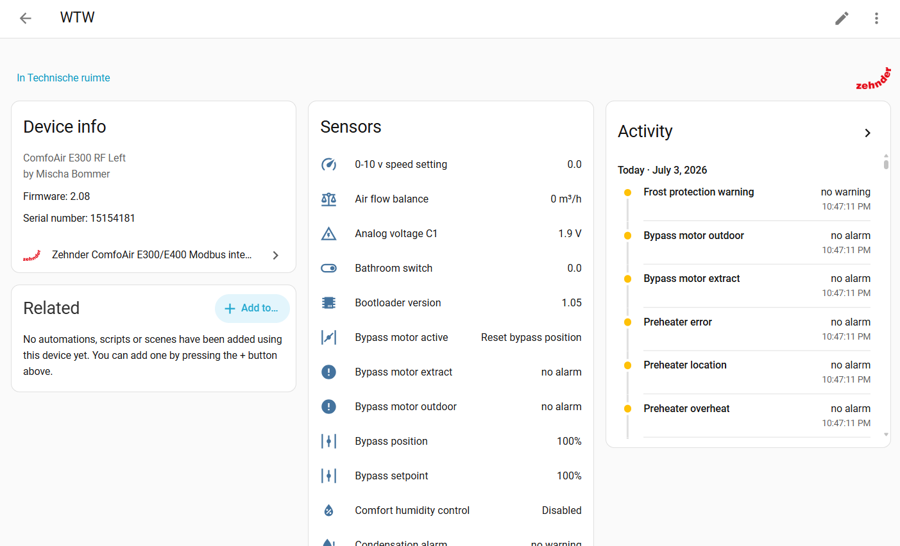

     

# Zehnder ComfoAir E300/E400 Home Assistant Integration

A Home Assistant custom integration for the Zehnder ComfoAir E300/E400 ventilation unit over Modbus (RTU or TCP), with a full sensor set, alarm monitoring, and configurable notifications.

> **Disclaimer**: This is an independent, community-built integration. It is not affiliated with, endorsed by, or supported by Zehnder. "Zehnder" and the Zehnder logo are trademarks of their respective owner, used here only to identify compatible hardware. The software is provided as-is (see [LICENSE](LICENSE)); wiring your unit and connecting a gateway is done at your own risk.

## Features

- Modbus RTU (serial) and Modbus TCP support, fully configurable through the Home Assistant UI (no YAML).
- 40+ sensors: temperatures, humidities, fan speeds, air flows, bypass position, speed setpoints, runtime counters and more.
- Calculated comfort sensors: absolute humidity, enthalpy, dew point (per air stream) and heat recovery efficiency.
- Binary sensors for every alarm/warning bit reported by the unit (sensor failures, filter warning/error, pre-heater faults, bypass motor faults, frost protection).
- **Condensation limit sensor and condensation alarm**: the lowest temperature that stays clear of condensation indoors, ready to use as a setpoint for underfloor cooling or a heat pump, with an optional alarm on a temperature entity of your own choosing.
- **Per-category notifications with quiet hours**: connection errors, alarms and warnings each have their own mobile notify services, notification subject, delay, recovery message and quiet-hours window, as push and/or persistent notifications.
- Fully reconfigurable afterwards via the integration's options screen - no need to remove and re-add the integration to change settings.
- Dutch and English translations of the UI.

## 📦 Installation

### HACS (default store)

Zehnder ComfoAir is available in the [HACS](https://hacs.xyz) default store.

1. Open **HACS** in Home Assistant.
2. Search for **Zehnder ComfoAir** and open it (or use the button above).
3. Click **Download**.
4. **Restart Home Assistant**.

### HACS (custom repository)

1. Open **HACS** in Home Assistant.
2. Click the three-dot menu (⋮) in the top right corner.
3. Select **Custom repositories**.
4. Add this repository URL: `https://github.com/remmob/comfoair`.
5. Set the category to **Integration** and click **Add**.
6. Search for **Zehnder ComfoAir** and download it.
7. **Restart Home Assistant**.

See the [official HACS documentation](https://hacs.xyz/docs/faq/custom_repositories/) for more details.

### Manual

1. Download or copy the `comfoair` folder from this repository: [`custom_components/comfoair`](custom_components/comfoair)
2. Place this folder in your Home Assistant installation under: `config/custom_components/comfoair`
3. **Restart Home Assistant**.

More info and updates:
- [GitHub: remmob/comfoair](https://github.com/remmob/comfoair)

## Hardware Requirements
This integration uses Modbus to connect to the Zehnder E300/E400 unit.

> **Beta note (v1.2.0-beta):** on Home Assistant 2026.9 and newer, ComfoAir now shares its
> Modbus TCP/RTU connection with other integrations talking to the same gateway (e.g. an
> Elfin EW-11), instead of opening its own socket. On older Home Assistant versions it opens
> its own connection exactly as before — nothing changes there. This only affects how the
> connection is managed under the hood; sensors, options and register behaviour are unchanged.

You can use a USB to RS485 adapter to connect to the unit. The adapter should be connected to the Modbus port on the unit. 
A+ to A and B- to B, if you receive no data, try to swap the A and B wires.
 Or alternatively, you can use a WiFi/Ethernet to RS485 gateway, which allows you to connect to the unit wirelessly or over ethernet.
Like an Elfin EW-11.

> ## Important! 
>Do not use the 12V of the Zehnder unit to power your gateway or WiFi device. It can not provide enough power and can damage your device. Use a separate power supply for your gateway or WiFi device.  

The integration supports both Modbus RTU (via USB) and Modbus TCP (via WiFi/Ethernet).

## Adding the Integration

Go to the Integrations page in Home Assistant and click on "Add Integration". Search for "Zehnder ComfoAir" and select it.

Give the unit a name (default: "zehnder"), used as a prefix for all its entities. The device ID cannot be changed and should be set to 1. Then choose the connection type (TCP or serial).

For a **serial (Modbus RTU)** connection, pick one of the available serial ports on your system. The connection settings are fixed and cannot be changed:
- Baudrate: 19200
- Parity: Even
- Stopbits: 1
- Bytesize: 8

For a **TCP** connection, provide the IP address and port of your Modbus TCP gateway. The default port is 502. Configure your Modbus RTU-to-TCP gateway with the same fixed serial settings as above.

The last step is to select how the bypass/pre-heater is controlled: analog (0-10V), RF, or 3-way switch. This determines which sensors are enabled by default; the other control types stay available but disabled. You can change this later from the integration's settings.

Every register is polled regardless of the selected control type, so if your unit is driven by more than one input — a 0-10V signal and a 3-way switch, say — you can enable the other control sensors yourself under the device's entity list and they will report valid values. Once you enable or disable one of them by hand, the integration leaves it alone: switching the control type later will not override your choice.

## Configuring the Integration

All settings can be changed after setup, without removing the integration. Open the integration's entry and click the gear icon.

This opens the settings screen, where you can change the connection details, the polling interval, the condensation settings, and the notification behavior.

*ℹ️ The screenshots above still show the older settings screen; the notification options are now grouped into the collapsible sections described below.*

### Condensation

- **Dew point margin**: safety margin above the indoor dew point. The **condensation limit** sensor reports the indoor dew point plus this margin: the lowest temperature that still stays clear of condensation.
- **Temperature entity for the condensation alarm** *(optional)*: pick the entity holding the flow temperature of your underfloor heating or cooling. The **condensation alarm** binary sensor goes off as soon as that temperature drops to or below the condensation limit. Leave it empty to only use the condensation limit sensor in your own automations.
- **Maximum change of the condensation limit (°C per hour)**: keeps the condensation limit sensor calm enough to feed to a heat pump as a setpoint. Showering raises the indoor humidity sharply for a couple of hours; this limits how fast the sensor may follow, so such a peak is flattened while slow changes still come through. `0` disables the limit. The condensation alarm always uses the unlimited value.

### Notifications

Notifications are grouped into collapsible sections, one per category. Each category is
configured independently, so a filter warning can go to a different phone than a
connection error - or nowhere at all.

- **General**: the shared toggle for persistent notifications (shown in the Home Assistant interface).
- **Connection errors**: the Modbus connection to the unit is lost.
- **Alarms**: faults of the ventilation unit, such as a sensor, fan or pre-heater error.
- **Warnings**: the filter warning and the frost protection warning.

Every category has its own:

| Option | What it does |
|--------|--------------|
| Notify on ... | Send mobile push notifications for this category |
| Notify on recovery | Send a follow-up message once the alarm/warning has cleared or the connection is back |
| Mobile notify services | The `notify.mobile_app_*` services for this category, picked from a list or entered as a comma-separated list |
| Notification subject | The title used for this category's notifications |
| Delay (seconds) | The condition is re-checked after this delay before notifying, which suppresses short-lived alarms |
| Quiet hours | Hold mobile notifications between a start and end time and deliver them once the period ends. Persistent notifications are never held |

Quiet hours for warnings default to **23:00-07:00**, so the filter and frost protection
warnings never wake anyone up at night - the same behaviour as before, now adjustable.
Quiet hours for connection errors and alarms default to **off**.

The device page shows the device info, all sensors and the recent alarm/warning activity:

## Register Table

| Register | Name                                          | Datatype | Unit   | Scale | Note                                                       |
|----------|------------------------------------------------|----------|--------|-------|-------------------------------------------------------------|
| 101      | Device status                                  | uint16   | -      | 1     | 0:Error;1:Initializing;2:Self Test;3:Waiting;10:Normal;20:Standby;42:Maintenance |
| 105      | Language                                       | uint16   | -      | 1     | 0:NL;1:DE;2:FR;3:EN                                          |
| 110      | Firmware version                               | uint16   | -      | 1     | 20800 = 2.8.0                                                |
| 111      | Orientation                                    | uint16   | -      | 1     | 0:Right;1:Left                                               |
| 112      | Model                                          | uint16   | -      | 1     | 0:E300 P;2:E300 RF;3:E400 RF                                 |
| 113      | Bootloader / hardware version                  | uint16   | -      | 1     | Packed as bootloader.hardware, e.g. 3.05                     |
| 115-130  | Serial number                                  | uint16   | -      | -     | One ASCII character per register                             |
| 300      | Intake air temperature                         | int16    | °C     | 0.1   |                                                               |
| 301      | Pre-heater temperature                         | int16    | °C     | 0.1   |                                                               |
| 303      | Supply air temperature                         | int16    | °C     | 0.1   |                                                               |
| 304      | Extract air temperature                        | int16    | °C     | 0.1   |                                                               |
| 305      | Exhaust air temperature                        | int16    | °C     | 0.1   |                                                               |
| 306      | Intake air humidity                            | uint16   | %      | 0.1   |                                                               |
| 307      | Supply air humidity                            | uint16   | %      | 0.1   |                                                               |
| 308      | Extract air humidity                           | uint16   | %      | 0.1   |                                                               |
| 309      | Exhaust air humidity                           | uint16   | %      | 0.1   |                                                               |
| 310      | Extract air fan                                | uint16   | %      | 0.1   |                                                               |
| 311      | Supply air fan                                 | uint16   | %      | 0.1   |                                                               |
| 312      | Extract air flow                                | uint16   | m³/h   | 1     |                                                               |
| 313      | Supply air flow                                 | uint16   | m³/h   | 1     |                                                               |
| 314      | Extract air fan speed                          | uint16   | rpm    | 1     |                                                               |
| 315      | Supply air fan speed                           | uint16   | rpm    | 1     |                                                               |
| 316      | Analog voltage C1                              | uint16   | V      | 0.01  |                                                               |
| 317      | RF voltage                                     | uint16   | V      | 0.01  |                                                               |
| 318      | RF enabled                                     | uint16   | -      | 1     | 0:OFF;1:ON                                                    |
| 319      | Pre-heater state                               | uint16   | -      | 1     | 0:OFF;1:ON                                                    |
| 320      | Extract air flow setpoint +- balance offset    | uint16   | m³/h   | 1     |                                                               |
| 321      | Supply air flow setpoint                       | uint16   | m³/h   | 1     |                                                               |
| 322      | Running mean outdoor temperature               | int16    | °C     | 0.1   |                                                               |
| 325      | Bypass motor active                            | uint16   | -      | 1     | 0:Reset bypass position;1:End position reached;2:Active      |
| 326      | Bypass setpoint                                | uint16   | %      | 1     |                                                               |
| 327      | Bypass position                                | uint16   | %      | 1     |                                                               |
| 328      | 0-10 V speed setting                           | uint16   | %      | 1     | 0:low;50:medium;100:high                                     |
| 329      | RF speed setting                               | uint16   | %      | 1     | 0:low;50:medium;100:high                                     |
| 330      | 3-way switch                                   | uint16   | %      | 1     | 0:low;50:medium;100:high                                     |
| 331      | Bathroom switch                                | uint16   | -      | 1     | 0:off;100:on                                                 |
| 334      | Defrost cycles last 24h                        | uint16   | -      | 1     |                                                               |
| 336      | Runtime in days                                | uint16   | days   | 1     |                                                               |
| 337      | Fireplace present                              | uint16   | -      | 1     | 0:OFF;1:ON                                                    |
| 338      | Pre-heater present                              | uint16   | -      | 1     | 0:OFF;1:ON                                                    |
| 344      | Heat exchanger type                            | uint16   | -      | 1     | 0:HRV;1:ERV                                                  |
| 345      | Comfort humidity control                       | uint16   | -      | 1     | 0:Disabled;1:Enabled                                         |
| 400      | Alarm bits, bank 1                              | uint16   | -      | -     | Bitmask, see [Alarm bits](#alarm-bits)                       |
| 402      | Alarm bits, bank 2                              | uint16   | -      | -     | Bitmask, see [Alarm bits](#alarm-bits)                       |

**Datatype**: uint16 = unsigned 16-bit, int16 = signed 16-bit.

**Scale**: Value must be multiplied by this factor for real-world value.

### Alarm bits

| Register | Bit | Description                    |
|----------|-----|----------------------------------|
| 400      | 0   | T20 temperature sensor          |
| 400      | 1   | T21 temperature sensor          |
| 400      | 2   | T22 temperature sensor          |
| 400      | 3   | T11 temperature sensor          |
| 400      | 4   | T12 temperature sensor          |
| 400      | 5   | RH20 humidity sensor            |
| 400      | 6   | RH22 humidity sensor            |
| 400      | 7   | RH11 humidity sensor            |
| 400      | 8   | RH12 humidity sensor            |
| 400      | 9   | dp12 pressure sensor            |
| 400      | 10  | dp22 pressure sensor            |
| 400      | 11  | Exhaust fan speed sensor        |
| 400      | 12  | Supply fan speed sensor         |
| 400      | 13  | Filter warning                  |
| 400      | 14  | Filter error                    |
| 402      | 0   | Pre-heater overheat             |
| 402      | 1   | Pre-heater location             |
| 402      | 2   | Pre-heater error                |
| 402      | 3   | Bypass motor extract            |
| 402      | 4   | Bypass motor outdoor            |
| 402      | 5   | Frost protection warning        |

Each bit is exposed as its own binary sensor. "Filter warning" and "Frost protection warning" belong to the **Warnings** notification category (quiet hours 23:00-07:00 by default); all other bits belong to the **Alarms** category.

### Calculated sensors

These are not raw Modbus registers, but derived from the temperature/humidity registers above:

- **Absolute humidity** (kg/kg) and **enthalpy** (kJ/kg) for the intake, supply, extract and exhaust air streams.
- **Dew point** (°C) for the intake, supply, extract and exhaust air streams.
- **Condensation limit** (°C): the indoor dew point (extract air) plus the configured dew point margin - the lowest temperature that stays clear of condensation. Optionally rate-limited so it can be used directly as a setpoint for underfloor cooling or a heat pump.
- **Heat recovery efficiency** (%), based on supply and extract air temperatures.
- **Air flow balance** (m³/h), the difference between supply and extract air flow.

---
©2026 Bommer Software | Author: Mischa Bommer
