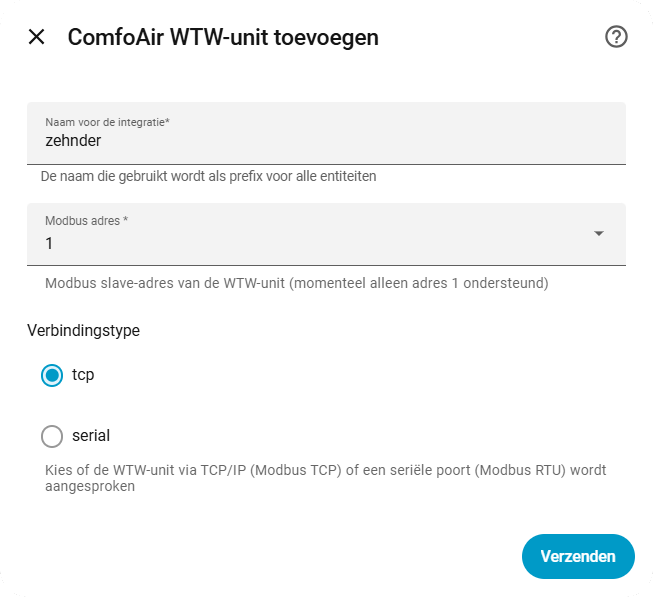
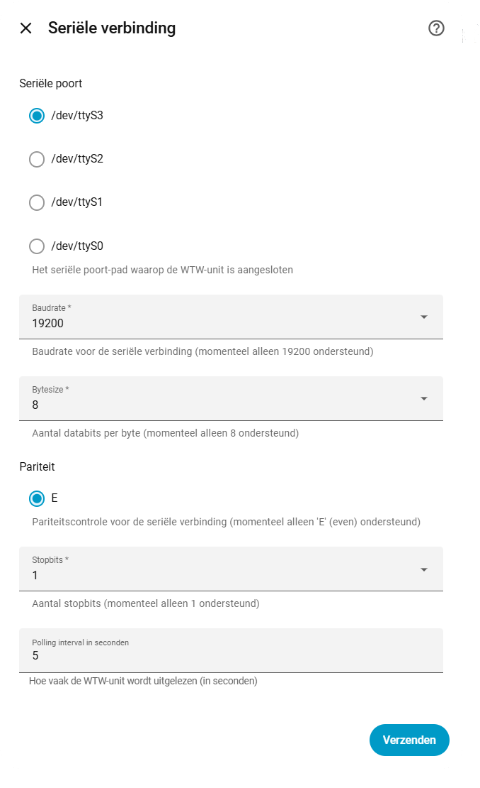
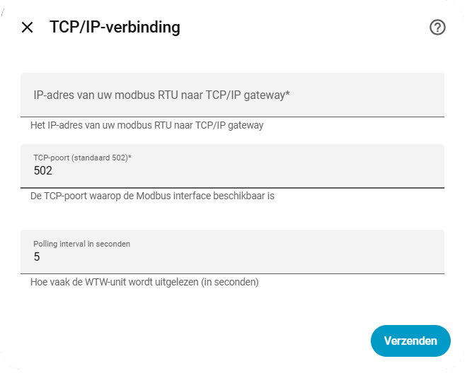
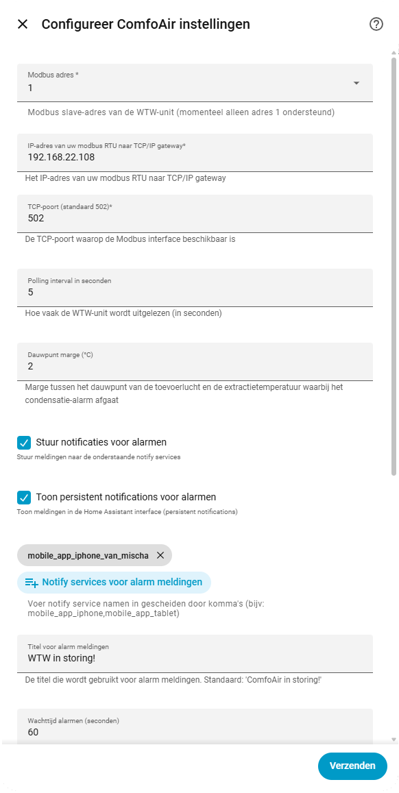
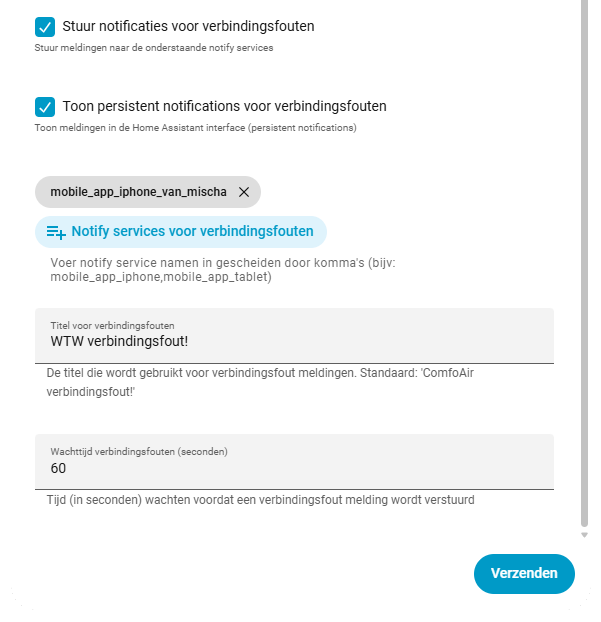

# Zehnder ComfoAir E300/E400 Home Assistant Integratie

Een Home Assistant custom integratie voor de Zehnder ComfoAir E300/E400 WTW-unit via Modbus (RTU of TCP), met een uitgebreide set sensoren, alarmbewaking en instelbare notificaties.

> **Disclaimer**: dit is een onafhankelijke, door de community gebouwde integratie. Deze is niet verbonden aan, goedgekeurd door, of ondersteund door Zehnder. "Zehnder" en het Zehnder-logo zijn handelsmerken van de betreffende eigenaar en worden hier uitsluitend gebruikt om compatibele hardware te identificeren. De software wordt geleverd zoals ze is (zie [LICENSE](LICENSE)); het bedraden van je unit en het aansluiten van een gateway doe je op eigen risico.

## Functionaliteit

- Modbus RTU (serieel) en Modbus TCP, volledig instelbaar via de Home Assistant UI (geen YAML nodig).
- 40+ sensoren: temperaturen, luchtvochtigheden, ventilatorsnelheden, luchtstromen, bypasspositie, snelheidsinstellingen, looptijdtellers en meer.
- Berekende comfortsensoren: absolute vochtigheid, enthalpie, dauwpunt (per luchtstroom) en warmteterugwinrendement.
- Binaire sensoren voor elk alarm-/waarschuwingsbit dat de unit rapporteert (sensorstoringen, filterwaarschuwing/-storing, voorverwarmerstoringen, bypassmotorstoringen, vorstbeveiliging), plus een condensatiealarm op de toevoerlucht op basis van het dauwpunt.
- Optionele push- en/of persistent notifications voor alarmen en voor verbindingsfouten, met instelbare wachttijd en een stille periode (07:00-23:00) voor niet-urgente waarschuwingen.
- Volledig herconfigureerbaar achteraf via het instellingenscherm van de integratie - de integratie hoeft niet verwijderd en opnieuw toegevoegd te worden om instellingen te wijzigen.

## Installatie

### HACS Custom Repository

1. Open HACS in Home Assistant.
2. Klik op het menu met de drie puntjes (⋮) rechtsboven.
3. Kies 'Custom repositories'.
4. Voeg deze repository-URL toe: `https://github.com/remmob/comfoair`.
5. Zet de categorie op **Integration**.
6. Klik op 'Add' om op te slaan.

Zie de [officiële HACS documentatie](https://hacs.xyz/docs/faq/custom_repositories/) voor meer details.

### Handmatig

1. Download of kopieer de map `comfoair` uit deze repository:
	[`custom_components/comfoair`](../comfoair)
2. Plaats deze map in je Home Assistant installatie onder:
	`config/custom_components/comfoair`
3. Herstart Home Assistant.
4. Voeg de integratie toe via het Integraties-scherm in de Home Assistant UI.

Meer info en updates:
- [GitHub: remmob/comfoair](https://github.com/remmob/comfoair)

## Hardware vereisten
Deze integratie gebruikt Modbus om verbinding te maken met de Zehnder E300/E400 unit.

Je kunt een USB naar RS485 adapter gebruiken om verbinding te maken met de unit. De adapter moet worden aangesloten op de Modbus-poort van de unit. 
A+ naar A en B- naar B; ontvang je geen data, probeer dan de A- en B-draden om te wisselen.
 Je kunt ook een WiFi/Ethernet naar RS485 gateway gebruiken, waarmee je draadloos of via ethernet verbinding maakt.
Bijvoorbeeld een Elfin EW-11.

> ## Belangrijk! 
>Gebruik niet de 12V van de Zehnder unit om je gateway of WiFi-apparaat te voeden. Deze kan niet genoeg vermogen leveren en kan je apparaat beschadigen. Gebruik een aparte voeding voor je gateway of WiFi-apparaat.  

De integratie ondersteunt zowel Modbus RTU (via USB) als Modbus TCP (via WiFi/Ethernet).

## De integratie toevoegen

Ga naar de pagina Integraties in Home Assistant en klik op "Integratie toevoegen". Zoek naar "Zehnder ComfoAir" en selecteer deze.

Geef de unit een naam (standaard: "zehnder"), die als prefix voor alle entiteiten wordt gebruikt. Het device ID kan niet gewijzigd worden en moet op 1 staan. Kies vervolgens het verbindingstype (TCP of serieel).

Voor een **seriële (Modbus RTU)** verbinding kies je een van de beschikbare seriële poorten op je systeem. De verbindingsinstellingen liggen vast en kunnen niet gewijzigd worden:
- Baudrate: 19200
- Pariteit: Even
- Stopbits: 1
- Bytesize: 8

Voor een **TCP**-verbinding geef je het IP-adres en de poort van je Modbus TCP-gateway op. De standaardpoort is 502. Configureer je Modbus RTU-naar-TCP-gateway met dezelfde vaste seriële instellingen als hierboven.

De laatste stap is het selecteren van het besturingstype van de bypass/voorverwarming: analoog (0-10V), RF, of 3-standenschakelaar. Dit bepaalt welke registers actief zijn; registers voor de andere besturingstypen blijven beschikbaar maar inactief. Je kunt dit later wijzigen via de instellingen van de integratie.

## De integratie configureren

Alle instellingen kunnen na het instellen worden gewijzigd, zonder de integratie te verwijderen. Open de integratie en klik op het tandwiel-icoon.

Dit opent het instellingenscherm, waar je de verbindingsgegevens, het poll-interval, de dauwpunt marge voor het condensatie-alarm, en het notificatiegedrag voor alarmen en verbindingsfouten kunt aanpassen.

- **Dauwpunt marge**: hoe dicht het dauwpunt van de toevoerlucht bij de extractietemperatuur mag komen voordat het condensatie-alarm afgaat.
- **Alarm meldingen**: stuur optioneel een mobiele pushmelding en/of een persistent notification zodra een alarm-/waarschuwingsbit actief wordt, na een instelbare wachttijd. Filterwaarschuwing en vorstbeveiligingswaarschuwing (niet-urgent) worden alleen tussen 07:00-23:00 gepusht; buiten dat venster worden ze vastgehouden en om 07:00 alsnog verstuurd.
- **Verbindingsfout meldingen**: hetzelfde mechanisme, geactiveerd zodra de unit niet meer bereikbaar is via Modbus.
- Notify services kun je kiezen uit je geconfigureerde `notify.mobile_app_*` services, of handmatig invoeren als een door komma's gescheiden lijst.

De apparaatpagina toont de apparaatinfo, alle sensoren en de recente alarm-/waarschuwingsactiviteit:

## Registertabel

| Register | Naam                                          | Datatype | Eenheid | Schaal | Notitie                                                     |
|----------|------------------------------------------------|----------|---------|--------|---------------------------------------------------------------|
| 101      | Apparaatstatus                                 | uint16   | -       | 1      | 0:Error;1:Initializing;2:Self Test;3:Waiting;10:Normal;20:Standby;42:Maintenance |
| 105      | Taal                                           | uint16   | -       | 1      | 0:NL;1:DE;2:FR;3:EN                                            |
| 110      | Firmwareversie                                 | uint16   | -       | 1      | 20800 = 2.8.0                                                  |
| 111      | Oriëntatie                                     | uint16   | -       | 1      | 0:Rechts;1:Links                                               |
| 112      | Model                                          | uint16   | -       | 1      | 0:E300 P;2:E300 RF;3:E400 RF                                   |
| 113      | Bootloader-/hardwareversie                     | uint16   | -       | 1      | Samengesteld als bootloader.hardware, bijv. 3.05               |
| 115-130  | Serienummer                                    | uint16   | -       | -      | Eén ASCII-teken per register                                   |
| 300      | Inlaatluchttemperatuur                         | int16    | °C      | 0.1    |                                                                 |
| 301      | Voorverwarmertemperatuur                       | int16    | °C      | 0.1    |                                                                 |
| 303      | Toevoerluchttemperatuur                        | int16    | °C      | 0.1    |                                                                 |
| 304      | Afzuigluchttemperatuur                         | int16    | °C      | 0.1    |                                                                 |
| 305      | Uitblaasluchttemperatuur                       | int16    | °C      | 0.1    |                                                                 |
| 306      | Inlaatluchtvochtigheid                         | uint16   | %       | 0.1    |                                                                 |
| 307      | Toevoerluchtvochtigheid                        | uint16   | %       | 0.1    |                                                                 |
| 308      | Afzuigluchtvochtigheid                         | uint16   | %       | 0.1    |                                                                 |
| 309      | Uitblaasluchtvochtigheid                       | uint16   | %       | 0.1    |                                                                 |
| 310      | Afzuigventilator                               | uint16   | %       | 0.1    |                                                                 |
| 311      | Toevoerventilator                               | uint16   | %       | 0.1    |                                                                 |
| 312      | Afzuigluchtstroom                               | uint16   | m³/h    | 1      |                                                                 |
| 313      | Toevoerluchtstroom                              | uint16   | m³/h    | 1      |                                                                 |
| 314      | Afzuigventilatorsnelheid                       | uint16   | rpm     | 1      |                                                                 |
| 315      | Toevoerventilatorsnelheid                      | uint16   | rpm     | 1      |                                                                 |
| 316      | Analoge spanning C1                            | uint16   | V       | 0.01   |                                                                 |
| 317      | RF-spanning                                    | uint16   | V       | 0.01   |                                                                 |
| 318      | RF ingeschakeld                                | uint16   | -       | 1      | 0:UIT;1:AAN                                                    |
| 319      | Voorverwarmerstatus                            | uint16   | -       | 1      | 0:UIT;1:AAN                                                    |
| 320      | Afzuigluchtstroom setpoint +- balansoffset     | uint16   | m³/h    | 1      |                                                                 |
| 321      | Toevoerluchtstroom setpoint                    | uint16   | m³/h    | 1      |                                                                 |
| 322      | Lopend gemiddelde buitentemperatuur            | int16    | °C      | 0.1    |                                                                 |
| 325      | Bypassmotor actief                             | uint16   | -       | 1      | 0:Bypasspositie reset;1:Eindpositie bereikt;2:Actief           |
| 326      | Bypass setpoint                                | uint16   | %       | 1      |                                                                 |
| 327      | Bypasspositie                                  | uint16   | %       | 1      |                                                                 |
| 328      | 0-10V snelheidsinstelling                      | uint16   | %       | 1      | 0:laag;50:midden;100:hoog                                      |
| 329      | RF snelheidsinstelling                         | uint16   | %       | 1      | 0:laag;50:midden;100:hoog                                      |
| 330      | 3-standenschakelaar                            | uint16   | %       | 1      | 0:laag;50:midden;100:hoog                                      |
| 331      | Badkamerschakelaar                             | uint16   | -       | 1      | 0:uit;100:aan                                                  |
| 334      | Ontdooicycli laatste 24u                       | uint16   | -       | 1      |                                                                 |
| 336      | Looptijd in dagen                              | uint16   | dagen   | 1      |                                                                 |
| 337      | Open haard aanwezig                            | uint16   | -       | 1      | 0:UIT;1:AAN                                                    |
| 338      | Voorverwarmer aanwezig                         | uint16   | -       | 1      | 0:UIT;1:AAN                                                    |
| 344      | Type warmtewisselaar                           | uint16   | -       | 1      | 0:HRV;1:ERV                                                    |
| 345      | Comfort vochtigheidsregeling                   | uint16   | -       | 1      | 0:Uitgeschakeld;1:Ingeschakeld                                 |
| 400      | Alarmbits, bank 1                              | uint16   | -       | -      | Bitmasker, zie [Alarmbits](#alarmbits)                         |
| 402      | Alarmbits, bank 2                              | uint16   | -       | -      | Bitmasker, zie [Alarmbits](#alarmbits)                         |

**Datatype**: uint16 = unsigned 16-bit, int16 = signed 16-bit.

**Schaal**: waarde moet met deze factor vermenigvuldigd worden voor de werkelijke waarde.

### Alarmbits

| Register | Bit | Omschrijving                    |
|----------|-----|-----------------------------------|
| 400      | 0   | T20 temperatuursensor            |
| 400      | 1   | T21 temperatuursensor            |
| 400      | 2   | T22 temperatuursensor            |
| 400      | 3   | T11 temperatuursensor            |
| 400      | 4   | T12 temperatuursensor            |
| 400      | 5   | RH20 vochtigheidssensor          |
| 400      | 6   | RH22 vochtigheidssensor          |
| 400      | 7   | RH11 vochtigheidssensor          |
| 400      | 8   | RH12 vochtigheidssensor          |
| 400      | 9   | dp12 druksensor                  |
| 400      | 10  | dp22 druksensor                  |
| 400      | 11  | Afzuigventilator snelheidssensor |
| 400      | 12  | Toevoerventilator snelheidssensor|
| 400      | 13  | Filterwaarschuwing               |
| 400      | 14  | Filterstoring                    |
| 402      | 0   | Voorverwarmer oververhitting     |
| 402      | 1   | Voorverwarmer locatie            |
| 402      | 2   | Voorverwarmer storing            |
| 402      | 3   | Bypassmotor afzuiging            |
| 402      | 4   | Bypassmotor buitenlucht          |
| 402      | 5   | Vorstbeveiligingswaarschuwing     |

Elk bit wordt als eigen binaire sensor beschikbaar gesteld. "Filterwaarschuwing" en "Vorstbeveiligingswaarschuwing" gelden als niet-urgente waarschuwingen en vallen onder het meldingsvenster van 07:00-23:00 hierboven beschreven; alle overige bits gelden als alarm.

### Berekende sensoren

Dit zijn geen ruwe Modbus-registers, maar worden afgeleid van de temperatuur-/vochtigheidsregisters hierboven:

- **Absolute vochtigheid** (kg/kg) en **enthalpie** (kJ/kg) voor de inlaat-, toevoer-, afzuig- en uitblaasluchtstroom.
- **Dauwpunt** (°C) voor de inlaat-, toevoer-, afzuig- en uitblaasluchtstroom, onder andere gebruikt voor het condensatiealarm op de toevoerlucht.
- **Warmteterugwinrendement** (%), gebaseerd op toevoer- en afzuigluchttemperatuur.
- **Luchtstroombalans** (m³/h), het verschil tussen toevoer- en afzuigluchtstroom.

---
©2026 Bommer Software | Auteur: Mischa Bommer
