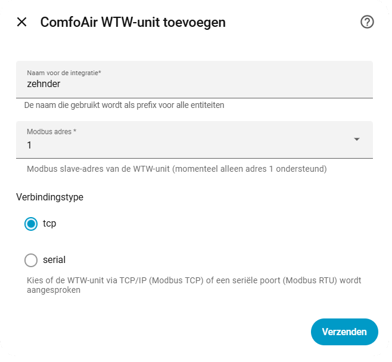
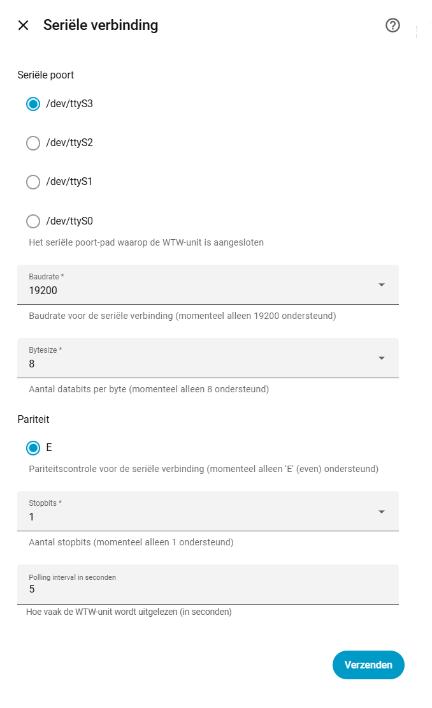
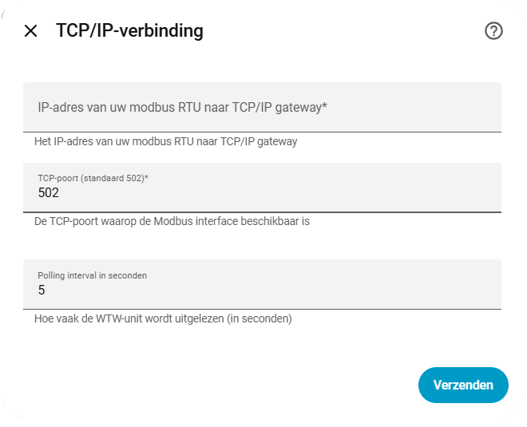
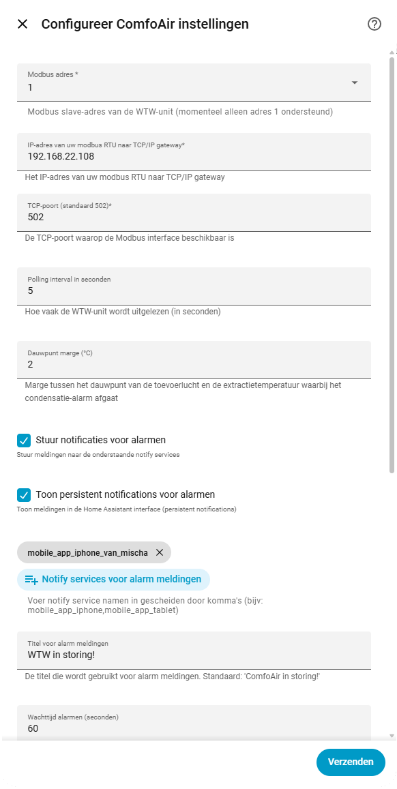
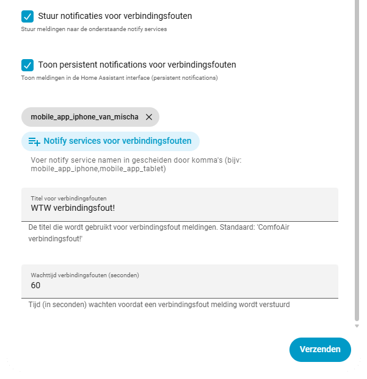

     

# Zehnder ComfoAir E300/E400 Home Assistant Integratie

Een Home Assistant custom integratie voor de Zehnder ComfoAir E300/E400 WTW-unit via Modbus (RTU of TCP), met een uitgebreide set sensoren, alarmbewaking en instelbare notificaties.

> **Disclaimer**: dit is een onafhankelijke, door de community gebouwde integratie. Deze is niet verbonden aan, goedgekeurd door, of ondersteund door Zehnder. "Zehnder" en het Zehnder-logo zijn handelsmerken van de betreffende eigenaar en worden hier uitsluitend gebruikt om compatibele hardware te identificeren. De software wordt geleverd zoals ze is (zie [LICENSE](LICENSE)); het bedraden van je unit en het aansluiten van een gateway doe je op eigen risico.

## Functionaliteit

- Modbus RTU (serieel) en Modbus TCP, volledig instelbaar via de Home Assistant UI (geen YAML nodig).
- 40+ sensoren: temperaturen, luchtvochtigheden, ventilatorsnelheden, luchtstromen, bypasspositie, snelheidsinstellingen, looptijdtellers en meer.
- Berekende comfortsensoren: absolute vochtigheid, enthalpie, dauwpunt (per luchtstroom) en warmteterugwinrendement.
- Binaire sensoren voor elk alarm-/waarschuwingsbit dat de unit rapporteert (sensorstoringen, filterwaarschuwing/-storing, voorverwarmerstoringen, bypassmotorstoringen, vorstbeveiliging).
- **Condensatiegrens-sensor en condensatie-alarm**: de laagste temperatuur die binnen nog veilig is tegen condensatie, direct bruikbaar als gewenste waarde voor vloerkoeling of een warmtepomp, met een optioneel alarm op een zelfgekozen temperatuur-entity.
- **Meldingen per categorie met stille uren**: verbindingsfouten, alarmen en waarschuwingen hebben elk hun eigen mobiele notify services, onderwerp, wachttijd, herstelmelding en stille periode, als push- en/of permanente melding.
- Volledig herconfigureerbaar achteraf via het instellingenscherm van de integratie - de integratie hoeft niet verwijderd en opnieuw toegevoegd te worden om instellingen te wijzigen.
- Nederlandse en Engelse vertaling van de UI.

## 📦 Installatie

### HACS (standaard store)

Zehnder ComfoAir is beschikbaar in de standaard store van [HACS](https://hacs.xyz).

1. Open **HACS** in Home Assistant.
2. Zoek op **Zehnder ComfoAir** en open het resultaat (of gebruik de knop hierboven).
3. Klik op **Downloaden**.
4. **Herstart Home Assistant**.

### HACS (custom repository)

1. Open **HACS** in Home Assistant.
2. Klik op het menu met de drie puntjes (⋮) rechtsboven.
3. Kies **Custom repositories**.
4. Voeg deze repository-URL toe: `https://github.com/remmob/comfoair`.
5. Zet de categorie op **Integration** en klik op **Add**.
6. Zoek op **Zehnder ComfoAir** en download het.
7. **Herstart Home Assistant**.

Zie de [officiële HACS documentatie](https://hacs.xyz/docs/faq/custom_repositories/) voor meer details.

### Handmatig

1. Download of kopieer de map `comfoair` uit deze repository: [`custom_components/comfoair`](custom_components/comfoair)
2. Plaats deze map in je Home Assistant installatie onder: `config/custom_components/comfoair`
3. **Herstart Home Assistant**.

Meer info en updates:
- [GitHub: remmob/comfoair](https://github.com/remmob/comfoair)

## Hardware vereisten
Deze integratie gebruikt Modbus om verbinding te maken met de Zehnder E300/E400 unit.

Je kunt een USB naar RS485 adapter gebruiken om verbinding te maken met de unit. De adapter moet worden aangesloten op de Modbus-poort van de unit. 
A+ naar A en B- naar B; ontvang je geen data, probeer dan de A- en B-draden om te wisselen.
 Je kunt ook een WiFi/Ethernet naar RS485 gateway gebruiken, waarmee je draadloos of via ethernet verbinding maakt.
Bijvoorbeeld een Elfin EW-11.

> ## Belangrijk! 
>Gebruik niet de 12V van de Zehnder unit om je gateway of WiFi-apparaat te voeden. Deze kan niet genoeg vermogen leveren en kan je apparaat beschadigen. Gebruik een aparte voeding voor je gateway of WiFi-apparaat.  

De integratie ondersteunt zowel Modbus RTU (via USB) als Modbus TCP (via WiFi/Ethernet).

## De integratie toevoegen

Ga naar de pagina Integraties in Home Assistant en klik op "Integratie toevoegen". Zoek naar "Zehnder ComfoAir" en selecteer deze.

Geef de unit een naam (standaard: "zehnder"), die als prefix voor alle entiteiten wordt gebruikt. Het device ID kan niet gewijzigd worden en moet op 1 staan. Kies vervolgens het verbindingstype (TCP of serieel).

Voor een **seriële (Modbus RTU)** verbinding kies je een van de beschikbare seriële poorten op je systeem. De verbindingsinstellingen liggen vast en kunnen niet gewijzigd worden:
- Baudrate: 19200
- Pariteit: Even
- Stopbits: 1
- Bytesize: 8

Voor een **TCP**-verbinding geef je het IP-adres en de poort van je Modbus TCP-gateway op. De standaardpoort is 502. Configureer je Modbus RTU-naar-TCP-gateway met dezelfde vaste seriële instellingen als hierboven.

De laatste stap is het selecteren van het besturingstype van de bypass/voorverwarming: analoog (0-10V), RF, of 3-standenschakelaar. Dit bepaalt welke sensoren standaard aan staan; de andere besturingstypen blijven beschikbaar maar uitgeschakeld. Je kunt dit later wijzigen via de instellingen van de integratie.

Alle registers worden uitgelezen, ongeacht het gekozen besturingstype. Wordt je unit door meerdere ingangen aangestuurd — bijvoorbeeld een 0-10V-signaal én een 3-standenschakelaar — dan kun je de andere besturingssensoren zelf inschakelen bij de entiteiten van het apparaat; ze geven gewoon geldige waarden. Zodra je er zelf één in- of uitschakelt laat de integratie hem met rust: ook bij het later wijzigen van het besturingstype blijft jouw keuze staan.

## De integratie configureren

Alle instellingen kunnen na het instellen worden gewijzigd, zonder de integratie te verwijderen. Open de integratie en klik op het tandwiel-icoon.

Dit opent het instellingenscherm, waar je de verbindingsgegevens, het poll-interval, de condensatie-instellingen en het meldingsgedrag kunt aanpassen.

*ℹ️ De schermafbeeldingen hierboven tonen nog het oudere instellingenscherm; de meldingsopties staan nu in de uitklapbare secties die hieronder beschreven zijn.*

### Condensatie

- **Dauwpunt marge**: veiligheidsmarge boven het dauwpunt binnen. De sensor **condensation limit** geeft het binnendauwpunt plus deze marge: de laagste temperatuur die nog veilig is tegen condensatie.
- **Temperatuur-entity voor het condensatie-alarm** *(optioneel)*: kies de entity met de aanvoertemperatuur van je vloerverwarming of -koeling. De binaire sensor **condensation alarm** gaat af zodra die temperatuur op of onder de condensatiegrens komt. Leeg laten als je alleen de condensatiegrens-sensor in je eigen automatiseringen wilt gebruiken.
- **Maximale verandering van de condensatiegrens (°C per uur)**: houdt de condensatiegrens-sensor rustig genoeg om als gewenste waarde aan een warmtepomp te geven. Douchen jaagt de luchtvochtigheid binnen kort omhoog en het duurt uren voor die weer zakt; dit begrenst hoe snel de sensor mag volgen, zodat zo'n piek wordt afgevlakt terwijl langzame veranderingen wel meekomen. `0` zet de begrenzing uit. Het condensatie-alarm gebruikt altijd de onbegrensde waarde.

### Meldingen

De meldingen staan in uitklapbare secties, één per categorie. Elke categorie stel je
apart in, zodat een filterwaarschuwing naar een andere telefoon kan gaan dan een
verbindingsfout - of naar niemand.

- **Algemeen**: de gedeelde schakelaar voor permanente meldingen (zichtbaar in de Home Assistant-interface).
- **Verbindingsfouten**: de Modbus-verbinding met de unit is weggevallen.
- **Alarmen**: storingen van de WTW-unit, zoals een sensor-, ventilator- of voorverwarmerfout.
- **Waarschuwingen**: de filterwaarschuwing en de vorstbeveiligingswaarschuwing.

Elke categorie heeft een eigen:

| Optie | Wat het doet |
|-------|--------------|
| Melden bij ... | Mobiele pushmeldingen voor deze categorie versturen |
| Melden bij herstel | Een vervolgmelding zodra het alarm/de waarschuwing weg is of de verbinding terug is |
| Mobiele notify services | De `notify.mobile_app_*` services voor deze categorie, te kiezen uit een lijst of in te voeren als door komma's gescheiden lijst |
| Onderwerp van de melding | De titel die voor deze categorie wordt gebruikt |
| Wachttijd (seconden) | Na deze wachttijd wordt opnieuw gecontroleerd voordat er gemeld wordt, wat kortstondige alarmen onderdrukt |
| Stille uren | Mobiele meldingen worden tussen een begin- en eindtijd vastgehouden en daarna alsnog bezorgd. Permanente meldingen worden nooit vastgehouden |

De stille uren voor waarschuwingen staan standaard op **23:00-07:00**, zodat de filter- en
vorstbeveiligingswaarschuwing niemand 's nachts wakker maken - hetzelfde gedrag als
voorheen, nu instelbaar. Voor verbindingsfouten en alarmen staan de stille uren standaard **uit**.

De apparaatpagina toont de apparaatinfo, alle sensoren en de recente alarm-/waarschuwingsactiviteit:

## Registertabel

| Register | Naam                                          | Datatype | Eenheid | Schaal | Notitie                                                     |
|----------|------------------------------------------------|----------|---------|--------|---------------------------------------------------------------|
| 101      | Apparaatstatus                                 | uint16   | -       | 1      | 0:Error;1:Initializing;2:Self Test;3:Waiting;10:Normal;20:Standby;42:Maintenance |
| 105      | Taal                                           | uint16   | -       | 1      | 0:NL;1:DE;2:FR;3:EN                                            |
| 110      | Firmwareversie                                 | uint16   | -       | 1      | 20800 = 2.8.0                                                  |
| 111      | Oriëntatie                                     | uint16   | -       | 1      | 0:Rechts;1:Links                                               |
| 112      | Model                                          | uint16   | -       | 1      | 0:E300 P;2:E300 RF;3:E400 RF                                   |
| 113      | Bootloader-/hardwareversie                     | uint16   | -       | 1      | Samengesteld als bootloader.hardware, bijv. 3.05               |
| 115-130  | Serienummer                                    | uint16   | -       | -      | Eén ASCII-teken per register                                   |
| 300      | Inlaatluchttemperatuur                         | int16    | °C      | 0.1    |                                                                 |
| 301      | Voorverwarmertemperatuur                       | int16    | °C      | 0.1    |                                                                 |
| 303      | Toevoerluchttemperatuur                        | int16    | °C      | 0.1    |                                                                 |
| 304      | Afzuigluchttemperatuur                         | int16    | °C      | 0.1    |                                                                 |
| 305      | Uitblaasluchttemperatuur                       | int16    | °C      | 0.1    |                                                                 |
| 306      | Inlaatluchtvochtigheid                         | uint16   | %       | 0.1    |                                                                 |
| 307      | Toevoerluchtvochtigheid                        | uint16   | %       | 0.1    |                                                                 |
| 308      | Afzuigluchtvochtigheid                         | uint16   | %       | 0.1    |                                                                 |
| 309      | Uitblaasluchtvochtigheid                       | uint16   | %       | 0.1    |                                                                 |
| 310      | Afzuigventilator                               | uint16   | %       | 0.1    |                                                                 |
| 311      | Toevoerventilator                               | uint16   | %       | 0.1    |                                                                 |
| 312      | Afzuigluchtstroom                               | uint16   | m³/h    | 1      |                                                                 |
| 313      | Toevoerluchtstroom                              | uint16   | m³/h    | 1      |                                                                 |
| 314      | Afzuigventilatorsnelheid                       | uint16   | rpm     | 1      |                                                                 |
| 315      | Toevoerventilatorsnelheid                      | uint16   | rpm     | 1      |                                                                 |
| 316      | Analoge spanning C1                            | uint16   | V       | 0.01   |                                                                 |
| 317      | RF-spanning                                    | uint16   | V       | 0.01   |                                                                 |
| 318      | RF ingeschakeld                                | uint16   | -       | 1      | 0:UIT;1:AAN                                                    |
| 319      | Voorverwarmerstatus                            | uint16   | -       | 1      | 0:UIT;1:AAN                                                    |
| 320      | Afzuigluchtstroom setpoint +- balansoffset     | uint16   | m³/h    | 1      |                                                                 |
| 321      | Toevoerluchtstroom setpoint                    | uint16   | m³/h    | 1      |                                                                 |
| 322      | Lopend gemiddelde buitentemperatuur            | int16    | °C      | 0.1    |                                                                 |
| 325      | Bypassmotor actief                             | uint16   | -       | 1      | 0:Bypasspositie reset;1:Eindpositie bereikt;2:Actief           |
| 326      | Bypass setpoint                                | uint16   | %       | 1      |                                                                 |
| 327      | Bypasspositie                                  | uint16   | %       | 1      |                                                                 |
| 328      | 0-10V snelheidsinstelling                      | uint16   | %       | 1      | 0:laag;50:midden;100:hoog                                      |
| 329      | RF snelheidsinstelling                         | uint16   | %       | 1      | 0:laag;50:midden;100:hoog                                      |
| 330      | 3-standenschakelaar                            | uint16   | %       | 1      | 0:laag;50:midden;100:hoog                                      |
| 331      | Badkamerschakelaar                             | uint16   | -       | 1      | 0:uit;100:aan                                                  |
| 334      | Ontdooicycli laatste 24u                       | uint16   | -       | 1      |                                                                 |
| 336      | Looptijd in dagen                              | uint16   | dagen   | 1      |                                                                 |
| 337      | Open haard aanwezig                            | uint16   | -       | 1      | 0:UIT;1:AAN                                                    |
| 338      | Voorverwarmer aanwezig                         | uint16   | -       | 1      | 0:UIT;1:AAN                                                    |
| 344      | Type warmtewisselaar                           | uint16   | -       | 1      | 0:HRV;1:ERV                                                    |
| 345      | Comfort vochtigheidsregeling                   | uint16   | -       | 1      | 0:Uitgeschakeld;1:Ingeschakeld                                 |
| 400      | Alarmbits, bank 1                              | uint16   | -       | -      | Bitmasker, zie [Alarmbits](#alarmbits)                         |
| 402      | Alarmbits, bank 2                              | uint16   | -       | -      | Bitmasker, zie [Alarmbits](#alarmbits)                         |

**Datatype**: uint16 = unsigned 16-bit, int16 = signed 16-bit.

**Schaal**: waarde moet met deze factor vermenigvuldigd worden voor de werkelijke waarde.

### Alarmbits

| Register | Bit | Omschrijving                    |
|----------|-----|-----------------------------------|
| 400      | 0   | T20 temperatuursensor            |
| 400      | 1   | T21 temperatuursensor            |
| 400      | 2   | T22 temperatuursensor            |
| 400      | 3   | T11 temperatuursensor            |
| 400      | 4   | T12 temperatuursensor            |
| 400      | 5   | RH20 vochtigheidssensor          |
| 400      | 6   | RH22 vochtigheidssensor          |
| 400      | 7   | RH11 vochtigheidssensor          |
| 400      | 8   | RH12 vochtigheidssensor          |
| 400      | 9   | dp12 druksensor                  |
| 400      | 10  | dp22 druksensor                  |
| 400      | 11  | Afzuigventilator snelheidssensor |
| 400      | 12  | Toevoerventilator snelheidssensor|
| 400      | 13  | Filterwaarschuwing               |
| 400      | 14  | Filterstoring                    |
| 402      | 0   | Voorverwarmer oververhitting     |
| 402      | 1   | Voorverwarmer locatie            |
| 402      | 2   | Voorverwarmer storing            |
| 402      | 3   | Bypassmotor afzuiging            |
| 402      | 4   | Bypassmotor buitenlucht          |
| 402      | 5   | Vorstbeveiligingswaarschuwing     |

Elk bit wordt als eigen binaire sensor beschikbaar gesteld. "Filterwaarschuwing" en "Vorstbeveiligingswaarschuwing" vallen onder de meldingscategorie **Waarschuwingen** (stille uren standaard 23:00-07:00); alle overige bits vallen onder de categorie **Alarmen**.

### Berekende sensoren

Dit zijn geen ruwe Modbus-registers, maar worden afgeleid van de temperatuur-/vochtigheidsregisters hierboven:

- **Absolute vochtigheid** (kg/kg) en **enthalpie** (kJ/kg) voor de inlaat-, toevoer-, afzuig- en uitblaasluchtstroom.
- **Dauwpunt** (°C) voor de inlaat-, toevoer-, afzuig- en uitblaasluchtstroom.
- **Condensatiegrens** (°C): het dauwpunt binnen (afzuiglucht) plus de ingestelde dauwpunt marge - de laagste temperatuur die nog veilig is tegen condensatie. Optioneel begrensd in snelheid, zodat je hem direct als gewenste waarde voor vloerkoeling of een warmtepomp kunt gebruiken.
- **Warmteterugwinrendement** (%), gebaseerd op toevoer- en afzuigluchttemperatuur.
- **Luchtstroombalans** (m³/h), het verschil tussen toevoer- en afzuigluchtstroom.

---
©2026 Bommer Software | Auteur: Mischa Bommer
